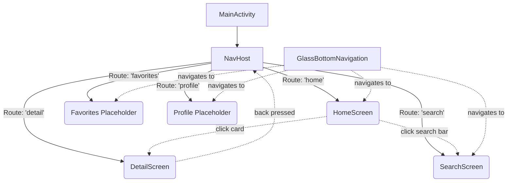

# Sajian Nusantara App Flow

## Overview

The *Sajian Nusantara* app showcases a unique "Culinary Editorial" design system. It moves away from rigid grid lists and utilizes intentional asymmetry, extreme typographic scaling, and a tactile "Glassmorphism" effect for digital heritage.

This document describes the application's underlying user flow and screen routing logic.

## User Flow

The typical journey of a user within the application is as follows:

1. **Discovery (Home Screen)**
   - The user opens the app and lands on the **Home Screen** (`daftar_resep`).
   - They are presented with an asymmetrical hero banner highlighting the featured recipe (e.g., "Rendang Minang Asli").
   - By scrolling vertically, they discover "Quick Tips" and other curated lists.
   - Clicking a pill in the Category row (e.g., POPULER, TRADISIONAL) filters the view without leaving the page.
   - **Action**: Tapping the "Rendang" featured card navigates the user to the `DetailScreen`.

2. **Exploration (Search Screen)**
   - If the user has a specific craving, they tap the `Search` icon on the Home Screen's search bar or the Bottom Navigation Bar.
   - This transitions them to the **Search Screen** (`pencarian_resep`).
   - The user can tap "Bahan Populer" tokens (Ayam, Daging, Tempe) for quick filtering or view "Pencarian Terbaru" (Recent Searches) to jump back into a recipe they were previously exploring.

3. **Engagement (Detail Screen)**
   - Found at `detail_resep`, this is the deepest level of engagement.
   - The screen hides the main Bottom Navigation Bar to maximize the immersive, edge-to-edge photography.
   - The user can toggle between the "Bahan-bahan" (Ingredients) checklist and "Cara Pembuatan" (Instructions) tabs.
   - **Action**: A prominent Floating Action Button ("Mulai Memasak") allows the user to lock their screen to cooking mode (future implementation).
   - The user returns to the previous screen using the back arrow in the transparent, blurred top bar.

## App Flow (Technical Navigation)

The app is built on a Single Activity Architecture using Jetpack Compose and `navigation-compose`.

### Screen States
*   **Bottom Navigation Logic**: The custom `GlassBottomNavigation` exists over the `NavHost`. In `MainActivity`, its visibility is tied to the current route. It displays on `home`, `search`, `favorites`, and `profile`, but is hidden on the `detail` route to support full-bleeding images.
*   **Theming/Colors**: Stored in `Color.kt` and `Theme.kt`, utilizing the predefined Nusantara color palette (warm surface backgrounds (`#fbf9f5`) and rich earthy primary actions (`#ad2c00`)). 
*   **State Retention**: Navigational back stacks are managed via `launchSingleTop` and `restoreState` so that navigating between tabs via the Bottom Navigation Bar preserves scroll position and input states.

